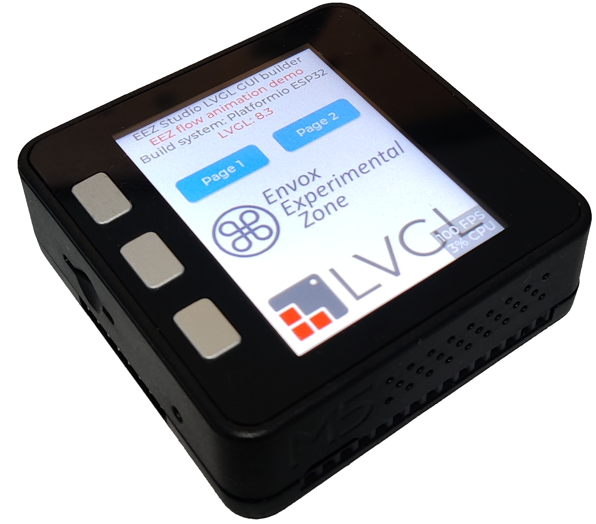
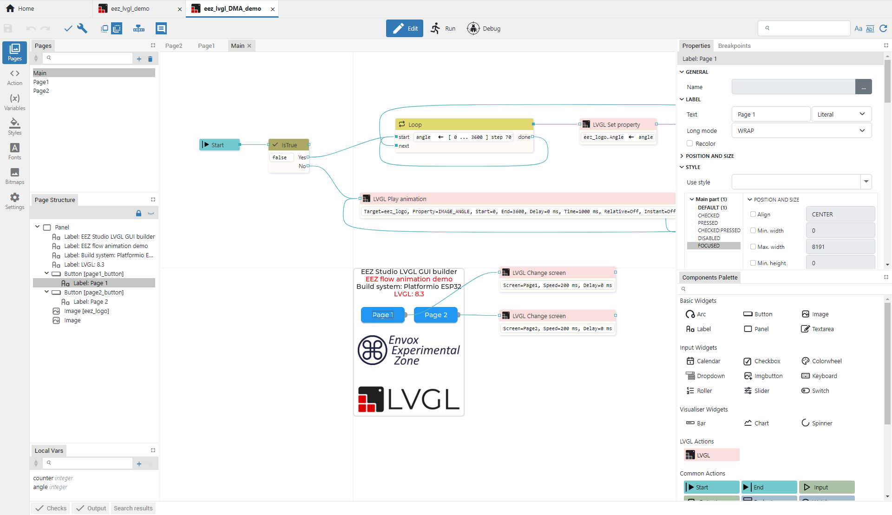

Before everything start, please power on your board, and check it if it works.

Install the PlatformIO with this guide: https://platformio.org/platformio-ide

Use PlatformIO to build and upload demo to your board.

